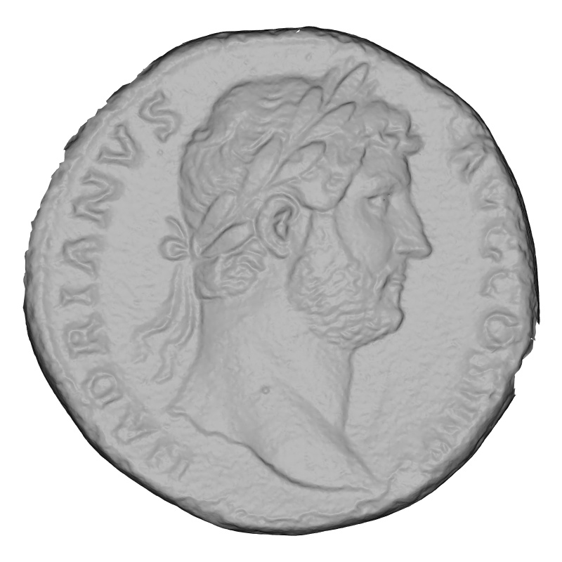
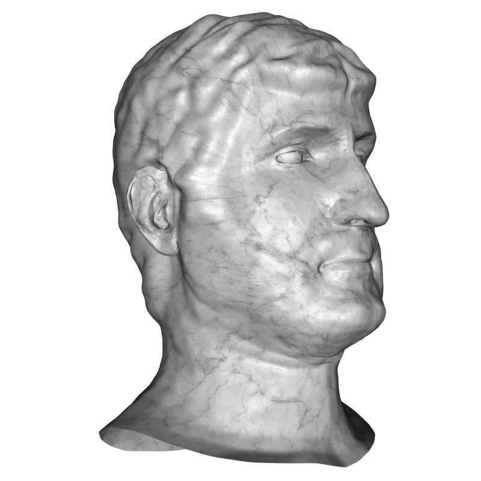
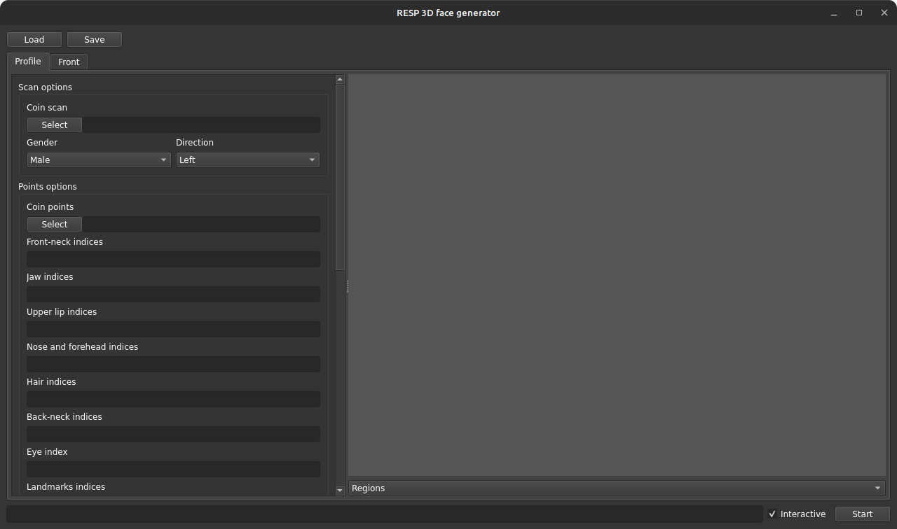
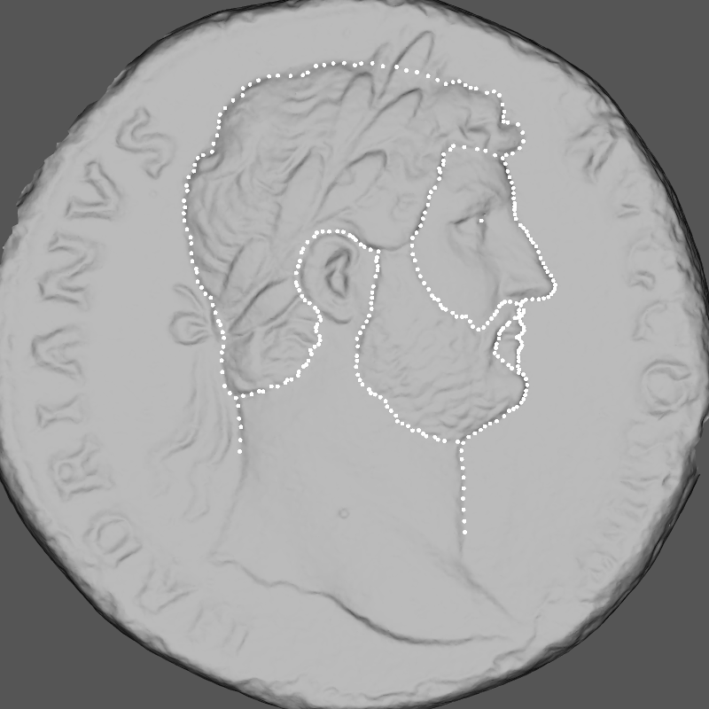
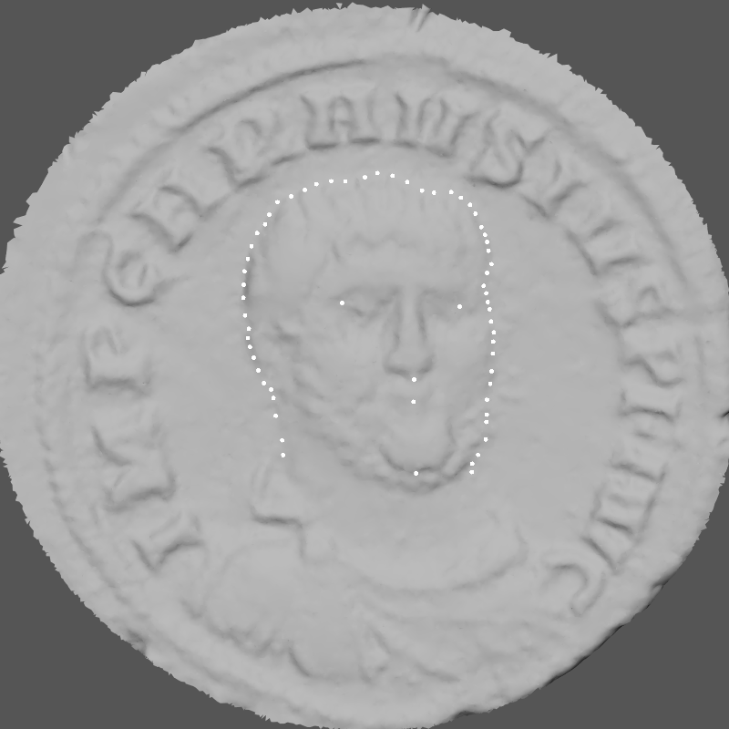

<div align="center">
   <br />
  <h1 align="center">
    <ins>RESP 3D Face generator</ins> <br />
    From coin to 3D face sculpture of roman emperors
  </h1>
</div>
<div align="center">
  <a href="mailto:umberto.castellani@univr.it">Umberto Castellani</a> · 
  <a href="mailto:riccardo.bartolomioli@univr.it">Riccardo Bartolomioli</a> ·
  <a href="mailto:giacomo.marchioro@univr.it">Giacomo Marchioro</a> ·
  <a href="mailto:dario.calomino@univr.it">Dario Calomino</a> <br />
  University of Verona
  <h2 align="center">
    3DOR'2024 <br />
    <a href="https://doi.org/10.1016/j.cag.2024.103999">Paper</a> |
    <a href="https://ercresp.info">Project</a>
  </h2>
</div>

## Introduction
Generate 3D face portraits of the roman emperors from ancient coin.
<div align="center">
  
  
</div>

## Requirements (Windows only)
Install WSL2, to do so follow the official Microsoft [guide](https://learn.microsoft.com/it-it/windows/wsl/install). Once WSL2 is installed and the Ubuntu environment is started, run
```bash
sudo apt update && sudo apt install -y gedit libsm6 libxext6 libgomp1
```

## Installation
To start the automatic installation, run the command
```bash
./install.sh
```
that will install conda (if not present) and create the environment with all necessary dependencies. It will also add the resp-app, resp-editor aliases, and related entries in the application menu. For manual installation, follow the guide below.

<details>
  <summary>Manual installation - click to expand</summary>
  
  This software requires Conda to run. To install it, run the following commands:
  ```bash
  # Single-user
  mkdir -p ~/miniconda3
  wget https://repo.anaconda.com/miniconda/Miniconda3-latest-Linux-x86_64.sh -O ~/miniconda3/miniconda.sh
  bash ~/miniconda3/miniconda.sh -b -u -p ~/miniconda3
  rm ~/miniconda3/miniconda.sh
  ~/miniconda3/bin/conda init bash && . ~/.bashrc
  ```
  or
  ```bash
  # Multi-user (root privileges required)
  sudo mkdir -p /opt/miniconda3
  sudo wget https://repo.anaconda.com/miniconda/Miniconda3-latest-Linux-x86_64.sh -O /opt/miniconda3/miniconda.sh
  sudo bash /opt/miniconda3/miniconda.sh -b -u -p /opt/miniconda3
  sudo rm /opt/miniconda3/miniconda.sh
  sudo group add miniconda
  sudo chgrp -R miniconda /opt/miniconda3
  sudo chmod 770 -R /opt/miniconda3
  # Setup da eseguire per ogni utente
  sudo adduser $USER miniconda
  /opt/miniconda3/bin/conda init bash && . ~/.bashrc
  ```
  Once Conda is installed, create a new environment:
  ```bash
  conda create -y -n RESP-coin python=3.10
  conda activate RESP-coin
  conda install -y pytorch=1.13.1 pytorch-cuda=11.7 -c pytorch -c nvidia
  conda install -y fvcore=0.1.5 iopath=0.1.9 -c fvcore -c iopath -c conda-forge
  conda install -y pytorch3d=0.7.5 -c pytorch3d
  conda install -y vedo=2024.5.1 opencv=4.7.0 pyside2=5.15.8 -c conda-forge
  pip install bpy==4.0.0 packaging==23.2
  ```
</details>

### Get FLAME model
Download FLAME model from [here](https://flame.is.tue.mpg.de). You need to sign up and agree to the model license for access to the model. Extract and copy the model files (`male_model.pkl` and `female_model.pkl`) into the folder `utils/flame_binaries`. Then, run the following commands:
```bash
conda create -n flameconvert python=3.7
conda activate flameconvert
pip install chumpy==0.70 pytorch==1.13
python utils/convert_flame.py
```
(Tested with FLAME v2020)

## Usage
To run the main application, run
```bash
python resp-app  # (with RESP-coin env active)
# or
conda run -n RESP-coin python app.py
```
The application window will appear
<p align="center"></p>
On the left side, there are some fields to complete with the necessary information for the generation process (see next section for more details), while on the right side there is a plot to get a graphical preview of the inserted data.

### Profile data
Use MeshLab PickedPoints to select the points from the coin scan, as shown in the figure below.
<p align="center"></p>

Once the points have been selected (and the PickePoints .pp file is generated), load the coin scan and the points file using their file selectors (`Coin scan` and `Coin points`). The information to be entered is as follows:
* Using the combo-boxes, it is possible to specify the gender of the represented subject (`Male` or `Female`) and the direction of the face (`Left` or `Right`).
* In the `Front-neck` indices field, the indices of the contour points belonging to the front part of the neck, which goes from the base to the crease with the jaw, must be indicated.
* In the `Jaw indices` field, the indices of the points belonging to the contour belonging to the jaw area, which goes from the fold with the neck to the center of the mouth, must be indicated).
* In the Upper lip indices field, the indices of the contour points belonging to the area of the upper lip, which goes from the center of the mouth (stomion) to the beginning of the nose (subnasal), must be indicated.
* In the `Nose-forehead indices` field, the indices of the contour points belonging to the nose-forehead area, which goes from the beginning of the nose (subnasale) to the hairline, must be indicated.
* In the `Hair indices` field, the indices of the contour points belonging to the hair area must be indicated, which goes from the front hairline to the back hairline.
* In the `Back-neck indices field`, the indices of the contour points belonging to the back part of the neck must be indicated, which goes from the back hairline to the base of the neck.
* The index of the points positioned on the eye (more precisely the pupil) must be indicated in the `Eye index` field.
* In the `Landmarks` field, the indices of 5 key points must be indicated: gnathion, stomion, subnasale, pronasale and glabella (in this exact order).
* In the `Hair and beard regions` field, the indices of the points that delimit the beard and hair area(s) must be indicated (in case of multiple areas, they must be separated with the '|' character). In this field the order of the points is crucial to correctly determine the areas of interest.

Note: Index lists must be specified as a comma-separated list of integers. To specify a sequence of consecutive integers more compactly, intervals can be specified with the syntax N-M, where N is the starting value (included) and M is the ending value (*not included*). Descending intervals are also allowed. Example: `0, 1, 2, 3-10, 10, 11` is a valid sequence and is equivalent to `0, 1, 2, 3, 4, 5, 6, 7, 8, 9, 10, 11`.

To get a graphical preview of the inserted data, click `Update plot`.

#### Profile generation option
In this section, you can enter the model generation parameters: 
* In the fields `Front-neck weight`, `Jaw weight`, `Upper lip weight`, `Nose weight`, `Hair weight`, `Back-neck weight`, `Eye weight` you can specify the corresponding "weight" of that area during the morphing phase (value greater than or equal to 0). By default, the value is set 1.0 for each region.
* The tolerance with respect to hair (`Tolerance`), represented by a fraction with respect to the standard deviation of the contour points (value greater than or equal to 0). By default, it is set to 0.1. It is advisable to raise this value, even up to 0.2, for faces with thick hair.
* The maximum relief length in the beard and hair areas (`Hair length` and `Beard length`), in centimeters. By default, they are set to 1.25 and 0.5.
* In the `smoothing weight` field, you can set the intensity of smoothing during the generation process (default at 1.0).

With the `Autofill` button, you can fill *all* options to the default values. Any values already entered will be overwritten.

### Front data (experimental)
<p align="center"></p>

In addition to the above information, it is also possible to enter information about a possible front coin. To enable its processing, check the `Enabled` checkbox. Once the coin and points are loaded (see image for reference), the following information must be entered:
* In the `Contour indices` field, the indices of the contour points should be entered.
* In the `Landmarks` field, the indices of 5 landmarks (left eye, right eye, subnasale, stomion, gnathion) should be indicated, i.e., easily recognizable landmarks that will be used by the software to perform the alignment.

#### Front generation options (experimental)
In this section, you can enter the model generation parameters, specifically: 
* In the `Contour weight` field, you can specify the "weight" of the contour during the modeling phase (value greater than or equal to 0). By default, the value is set to 0.01.

### Run, Load and Save
Once all the data have been entered *correctly*, start the processing with the `Start` button and then choose the folder in which to save the results. If the `Interactive` checkbox is flagged, interactive plots will be shown during the process to monitor each step. Once the processing is finished, a plot with the final result (final.obj) will be shown. Once the latter is closed, a new window will be opened where it will be possible to apply, via sliders, some modifications.

To save the entered data, press `Save` and choose where to save the project file. To load an existing project, press `Load`. There is an example projects in the `examples` folder.

### Other tools
To edit a previous result, run
```bash
resp-editor [PATH_TO_OUTPUT]  # (with RESP-coin env active)
# or
conda run -n RESP-coin python editor.py
```
where `PATH_TO_OUTPUT` is the (optional) path to the output folder, which must contain the files mesh_params.pt, wp.pkl, disp.png.

## BibTeX
If you use any ideas from the paper or code from this repo, please consider citing:
```bibtex
@article{CASTELLANI2024103999,
    title = {From coin to 3D face sculpture portraits in the round of Roman emperors},
    journal = {Computers & Graphics},
    volume = {123},
    pages = {103999},
    year = {2024},
    issn = {0097-8493},
    doi = {https://doi.org/10.1016/j.cag.2024.103999},
    url = {https://www.sciencedirect.com/science/article/pii/S0097849324001341},
    author = {Umberto Castellani and Riccardo Bartolomioli and Giacomo Marchioro and Dario Calomino},
    keywords = {3D face, Morphable model, Model fitting, 3D scanning},
}
```
